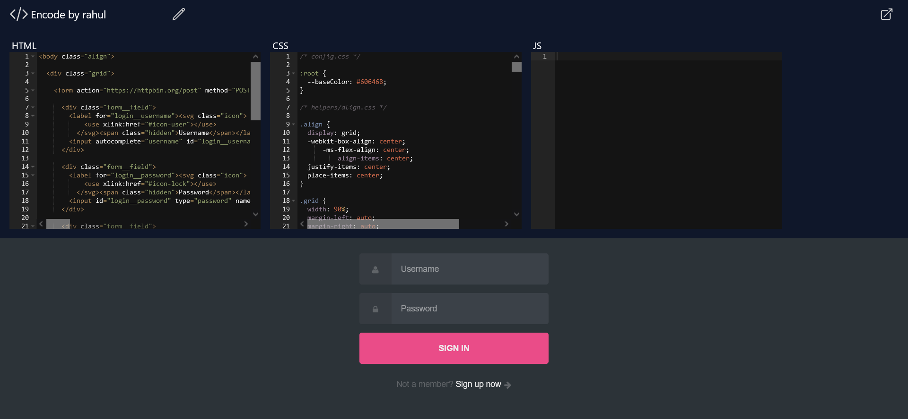

# Encode

Encode is a web application that allows users to write, edit, and preview HTML, CSS, and JavaScript code in real-time. With this tool, users can quickly test and refine their code, without having to set up a local development environment.

## Table of contents

- [Overview](#overview)
  - [Screenshot](#screenshot)
  - [Links](#links)
- [My process](#my-process)
  - [Built with](#built-with)
  - [What I learned](#what-i-learned)
  - [Useful resources](#useful-resources)

## Overview

### Screenshot



### Links

- Live Site URL: [https://encode-rahul.vercel.app/](https://encode-rahul.vercel.app/)

## My process

### Built with

- [React.js](https://reactjs.org/) - JS library
- [Tailwind CSS](https://tailwindcss.com/) - For styles

### What I learned

- Custom Hooks

```js
import { useState } from "react";
export function useLocalStorage(key, initialValue) {
  const keyName = "ENCODE-" + key;
  const [storedValue, setStoredValue] = useState(() => {
    const item = window.localStorage.getItem(keyName);
    return item ? JSON.parse(item) : initialValue;
  });

  const setValue = (value) => {
    setStoredValue(value);
    window.localStorage.setItem(keyName, JSON.stringify(value));
  };

  return [storedValue, setValue];
}
```

### Useful resources

- [React.js](https://reactjs.org/)
- [Tailwind CSS](https://tailwindcss.com/)
